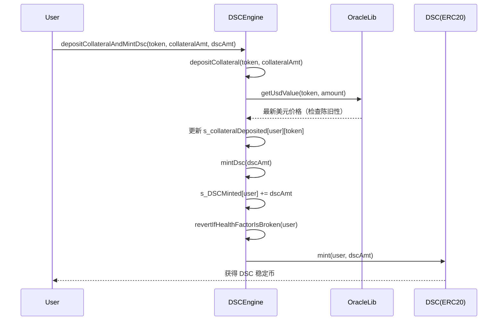
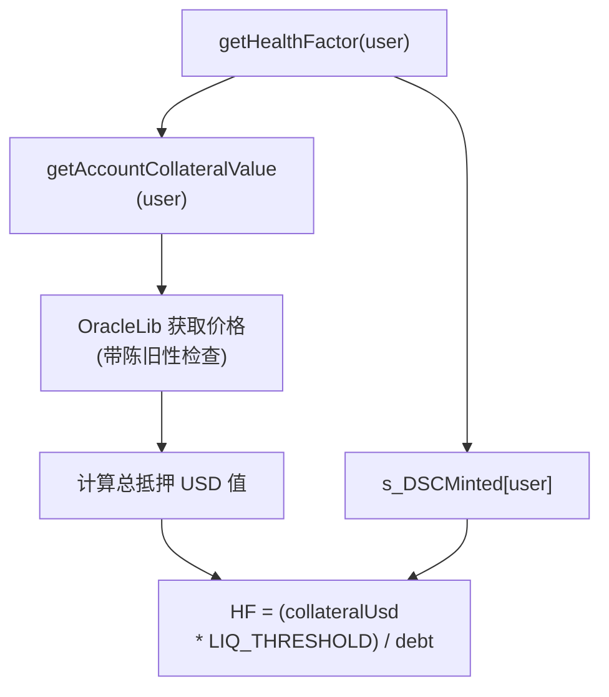
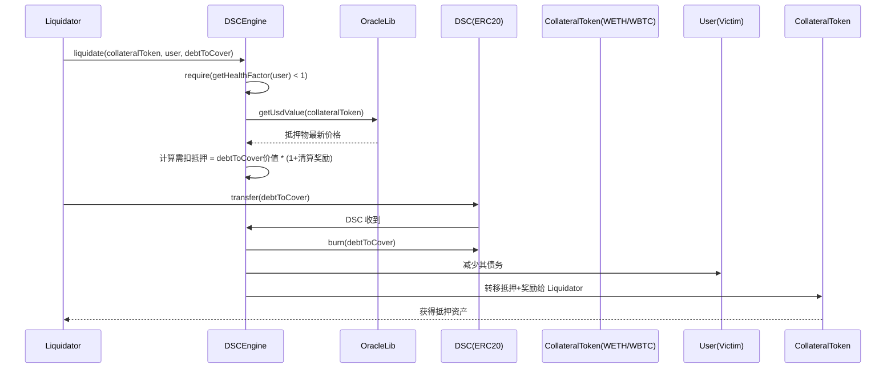

# DeFi Stablecoin 项目核心流程（DSCEngine）

## Table of Contents

- [DeFi Stablecoin 项目核心流程（DSCEngine）](#defi-stablecoin-项目核心流程dscengine)
  - [Table of Contents](#table-of-contents)
  - [Overview](#overview)
  - [A. Token 铸造流程 (Minting)](#a-token-铸造流程-minting)
  - [B. Health Factor 计算](#b-health-factor-计算)
  - [C. Liquidation (清算流程)](#c-liquidation-清算流程)

## Overview

## A. Token 铸造流程 (Minting)

## B. Health Factor 计算

## C. Liquidation (清算流程)

